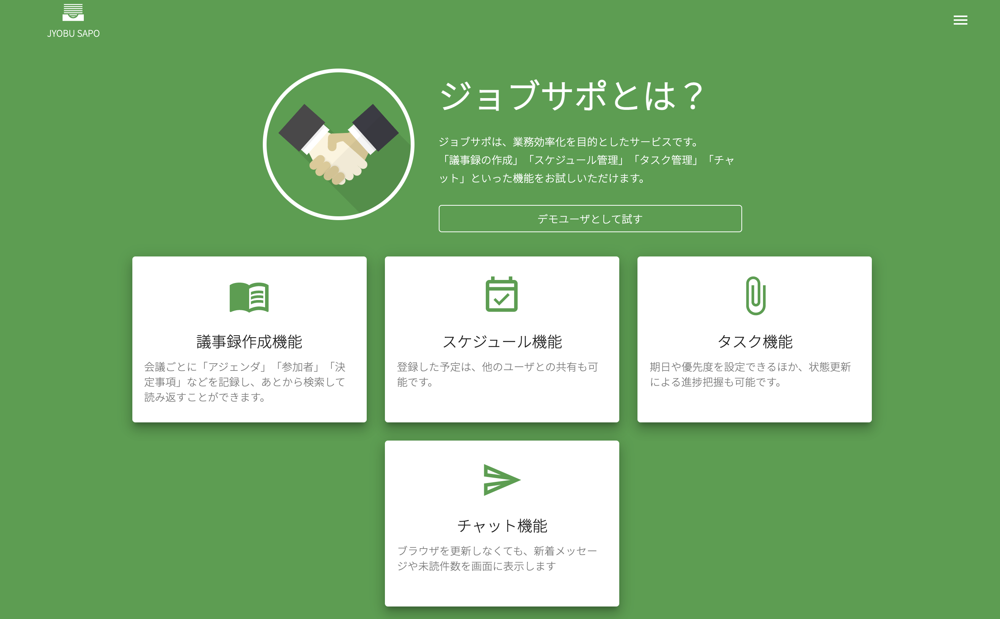

# 業務支援システム

`議事録作成`、`スケジュール管理`、`タスク管理`、`チャット`等の機能を実装した、業務支援を目指すシステムです。

# リンク

- サイトリンク：https://job-support.site

- Next.js のソースコード：https://github.com/kabatech255/job-support-next

# 「デモユーザーとして試す」

- デモユーザー「テスト太郎」としてログインし、サイト内のサービスをご精査いただけます

# 制作目的

前回制作した[コンプラ検査サイト](https://github.com/kabatech255/shisetsu) の続編として、

- TypeScript の基礎
- Next.js、React の学習
- Material UI や Vercel など React に付随する技術の学習
- UI についてはフレームワーク（今回は Material UI）に極力依存する

などが主な目的です。

# 機能

### 主な機能一覧

- 認証機能（ログイン、ログアウト）
- パスワードリマインダ
- プロフィール編集
- 設定（メール通知）
- `議事録管理`
- `タスク管理`
- `スケジュール管理`
- `チャット`
- `メール通知`
- チャット画面のリアルタイム更新

### メール通知について

メール通知の処理は、**Laravel**で用意されている**Notification** クラス内で **Queueable** トレイトを**use**することでキューへ投入しており、非同期処理によるレスポンスタイム短縮を心がけております。Laravel とは別途**Supervisor**用の Docker コンテナを立ち上げ、`キューワーカ`および`タスクスケジュール`をエントリした`cron`のプロセスを監視しております。

##### 通知のタイミング

- 他のユーザから新しくスケジュールが共有されたとき
- 他のユーザが新しく議事録を追加したとき（会議の参加者として入力された場合）
- 参加するチャットルームにメッセージが投稿されたとき

---

以下はデイリー配信

- 翌日締切のタスク一覧（夜 6:00 頃）
- 当日の予定一覧（朝 8:00 頃）

上記はすべて`設定ページ`から通知の`許可・不許可`を設定でき、不許可の場合はメールを受信しません。

### チャット画面のリアルタイム更新について

**Laravel Pusher** を使ってイベントをブロードキャストし、クライアント側は**Laravel Echo**等のライブラリを使ってイベントをリッスンしております。

# アーキテクチャ

**Laravel**ベースのバックエンドについては、**CircleCI** から **ECR** に プッシュ したイメージを、**ECS（EC2 タイプ）** にデプロイしています。
web サーバーに **Nginx** を使い、**ALB** でリクエストの分配を行っています。

画像ファイルやフォント等は**S3** と **CloudFront** を使った CDN 配信も行っております。

# 開発環境

### マシン

- MacBookPro

### 仮想化プラットフォーム

- Docker for Mac

### コード管理

- GitHub

### CI/CD

- CircleCI

# 主な使用技術

- PHP 7.3
- Laravel 7.30
- Nginx 1.15
- Node.js 14.17
- Next.js 11.0.1
- TypeScript 4.3.5
- MySQL 5.7.29
- AWS
  - VPC
  - ECS（EC2 タイプ）/ECR
  - ALB
  - RDS for MySQL
  - S3
  - CloudFront
  - Route53
  - ACM
  - Amazon SES
- Docker
- CircleCI
  - ecs-deploy
- GitHub
- Terraform
- Vercel
- OpenAPI

### クライアント側の主なライブラリ

- Material UI
- FullCalendar
- react-hook-form

# アピールポイント

- Next.js を使用し、Vercel へのデプロイに挑戦したこと
- フロントエンド開発において、主に React + Material UI + TypeScript に挑戦したこと
